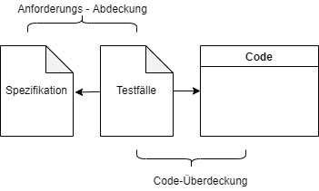
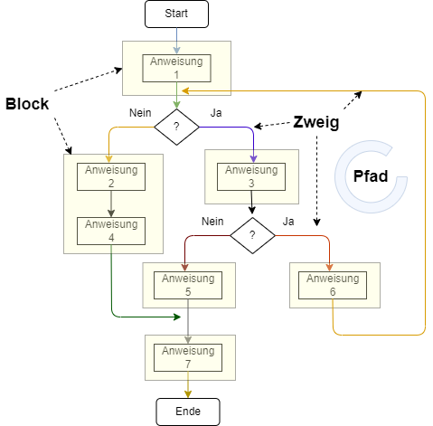

# Whitebox (Codeüberdeckungs-) Tests
Whitebox Analyse ist ein formelles Analyseverfahren, bei dem der Entwickler den Code vorliegen hat. Über die speziellen Funktionen des Programms in Form einer Spezifikation muss er nicht zwingend informiert sein. Das Ergebnis eines Whitebox Testes erlaubt aber Aussagen über die Qualität der Testfälle eines Blackbox / Unittest auszusagen. Ziel ist es eine Codeüberdeckung von 100% zu erreichen. 

Aus der Spezifikation wurden dabei ggf. schon Testfälle abgeleitet. Der Codeüberdeckungstest prüft dabei nach, ob diese Testfälle hinreichend sind, und der gesamte Code abgedeckt (also geprüft) ist.



## von Anweisungen, Blöcken, Zweigen und Pfaden
Ein Programm wird dabei betrachtet als eine Reihe von Anweisungen. Diese Anweisungen bilden Blöcke, die durch Kontrollflusselemente wie Bedingungen und Schleifen aufgeteilt wird in verschiedene Zweige und Pfade.



Ziel des Whiteboxtests ist es dabei eine Überdeckung (Code Coverage) von 1 zu erreichen. Damit ist das Programm (die Methode) correct. Der tester muss also kein Wissen haben fun der konkreten Funktion einer Methode (deren Spezifikation).

## Anweisungs- oder Blocküberdeckung

Bei der Anweisungs- oder Blocküberdeckung versucht man alle Anweisungen bzw. Blöcke eines Programms zu erreichen. Gelingt dieses, so ist die Coverage $C_{0} = 1$ bzw. $C_{Block} = 1$

$C_{0} = \frac{Anzahl der ausgeführten Anweisungen}{Anzahl der Anweisungen}$

$C_{Block} = \frac{Anzahl der ausgeführten Blöcke}{Anzahl der Blöcke}$

### Beispiel
Folgender Code soll mit Hilfe einer Blocküberdeckung getestet werden.

```java
public static int calc(int a,int b) {
    int a,y,z;
    if (a < b) {
        x=b; // Block 1
        z=1;
    }
    else {
        x=a; // Block 2
        z=0;
    }
    if ((a+b)<10) {
        y=x+b/z; // Block 3
    }
    else {
        y=x+a; // Block 4
        if ((a+b) == 7) {
            y++ // Block 5
        }
    }
    return x+y+z; // Block 6
}
```

Mit Hilfe eines Testprogramms versucht man nun alle 6 Blöcke zu erreichen.

```java
public static int calc(int a,int b) {
    int a,y,z;
    if (a < b) {
        x=b; // Block 1
        z=1;
        System.out.println("B1");
    }
    else {
        x=a; // Block 2
        z=0;
        System.out.println("B2");
    }
    if ((a+b)<10) {
        y=x+b/z; // Block 3
        System.out.println("B3");
    }
    else {
        y=x+a; // Block 4
        System.out.println("B4");
        if ((a+b) == 7) {
            y++ // Block 5
            System.out.println("B5");
        }
    }
    System.out.println("B6");
    return x+y+z; // Block 6
}
```

|Testwerte|erreichte Blöcke soll| erreichte Blöcke ist|soll-ist Vergleich|
|--|--|--|--|
|a=2; b=5|1,3,6| B1; B3; B6 | ok|
|a=11; b=4|2,4,6| B2; B4; B6 | ok|
|?|5| nicht erreichbar | Fehler|

Damit beträgt die Blocküberdeckung $C_{Block} = 0,83$

$C_{Block} = \frac{5}{6}$

Der Tester hat also formell nachgewiesen, dass keine Blocküberdeckung von 1 erreicht werden kann, d.h. dass der Code fehlerhaft ist.

## Zweigüberdeckung
Unter einem Zweig versteht man eine gerichtete Kante eines Kontrollflussgraphen (z.B. durch Bedingungen oder Schleifen). Wichtig dabei ist, dass alle Kanten erfasst werden, also z.B. eine Bedingung, die keinen else Zweig hat, besitzt dennoch zwei Kanten. Ebenso bei kopfgesteuerten Schleifen, denn hier kann es sein, dass die Schleife durchlaufen wird, oder aufgrund der Bedingung gar nicht durchlaufen wird.

$C_{Zweig} = \frac{Anzahl der ausgeführten Zweige}{Anzahl der Zeige}$

Der folgende Code kann z.B. wie folgt als Graph dargestellt werden.

```java
    public static int calc(int a) {
        int b=0;
        while (a%4==0) {
            a=a+2;
            if (a%2==0) {
                b=b+a;
            }
        }
        return b;
    }
```


Es existieren also die Zweige Z1 bis Z9. Bei der Zweigüberdeckung gilt es nun zu prüfen ob alle Zweige zu erreichen sind.


|Testwerte|erreichte Blöcke |Ergebnis|
|--|--|--|
|a=3|Z1,Z2,Z4| ok|
|a=4|Z1,Z2,Z3,Z5,Z6,Z8,Z9,Z4| ok|
|?| nicht erreichbar Z7 | Fehler|

Wie sich bei der Untersuchung herausstellt, ist der Zweig Z7 nicht zu erreichen. Die Zweigüberdeckung beträgt

$C_{Zweig} = \frac{8}{9} = 88,8\%$

Ein Anweisungs- oder Blocküberdeckungstest hätte in diesem Fall jedoch eine Überdeckung von 100% ergeben.